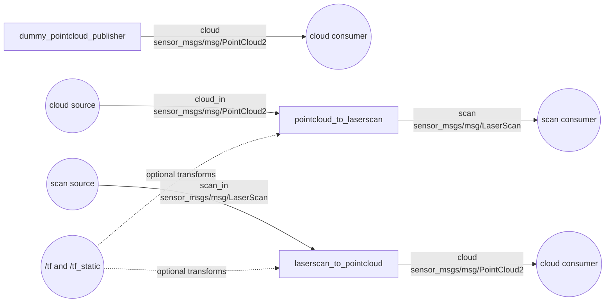

# pointcloud_to_laserscan

ROS 2 components and executables for converting between 3D point clouds and 2D laser scans.

## Table of Contents

- [Overview](#overview)
- [Installation & Build](#installation--build)
- [Nodes / Executables](#nodes--executables)
- [Launch Files](#launch-files)
- [Interfaces](#interfaces)
- [Configuration](#configuration)
- [Testing](#testing)
- [Known Issues](#known-issues)
- [Glossary](#glossary)

## Overview

`pointcloud_to_laserscan` converts `sensor_msgs/msg/PointCloud2` data into planar `sensor_msgs/msg/LaserScan` data for 2D consumers such as laser-based SLAM, provides the inverse LaserScan-to-PointCloud2 projection, and includes a deterministic dummy cloud publisher. Both converters support lazy input subscription and optional TF transformation. In the supplied DHAS launch file, non-ground points from `patchworkpp/nonground` become `laser/scan` in the `laserscan` frame. The package is version 2.0.1 and BSD-licensed (`package.xml:4`, `LICENSE`).

- **Build type:** `ament_cmake`, using `ament_cmake_auto` (`package.xml:19`, `package.xml:44`; `CMakeLists.txt:4-5`).
- **ROS distribution:** the package does not declare one. The inspected workspace environment is ROS 2 Humble, but compatibility with Humble or any other distribution is **[UNCLEAR — verify]**.
- **Install/export behavior:** `ament_auto_package()` installs the public headers, shared libraries, component registration metadata, and executables generated by the CMake targets. It additionally installs `launch/` under the package share directory (`CMakeLists.txt:7-23`, `CMakeLists.txt:30-33`). No `config/` directory is installed.

### Package dependencies

No matching source packages for these dependencies were found in this workspace, so all are classified as external. A `<depend>` is a combined build, build-export, and execution dependency in package format 2.

| Name | Manifest type | Internal / external | Purpose |
|---|---|---|---|
| `ament_cmake_auto` | `buildtool_depend` | External | Finds declared dependencies and creates/installs CMake targets automatically. |
| `laser_geometry` | `depend` | External | Projects `LaserScan` samples into a `PointCloud2`. |
| `message_filters` | `depend` | External | Provides the deferred input subscribers. |
| `rclcpp` | `depend` | External | ROS 2 C++ nodes, publishers, parameters, executors, and QoS. |
| `rclcpp_components` | `depend` | External | Registers both converter classes as components and generates standalone executables. |
| `sensor_msgs` | `depend` | External | Supplies `PointCloud2`, `PointField`, and `LaserScan`. |
| `tf2` | `depend` | External | Transform types, durations, and exceptions. |
| `tf2_ros` | `depend` | External | TF buffer/listener, transform-aware message filtering, and timer integration. |
| `tf2_sensor_msgs` | `depend` | External | Applies transforms to `PointCloud2` messages. |
| `launch` | `exec_depend` | External | ROS 2 launch framework required by installed launch files. |
| `launch_ros` | `exec_depend` | External | ROS-aware launch actions/XML tags. |
| `ament_lint_auto` | `test_depend` | External | Discovers enabled lint checks. |
| `ament_cmake_cppcheck` | `test_depend` | External | Static C/C++ analysis. |
| `ament_cmake_cpplint` | `test_depend` | External | C/C++ style checks. |
| `ament_cmake_flake8` | `test_depend` | External | Python style checks; retained even though the current tree has no Python files. |
| `ament_cmake_lint_cmake` | `test_depend` | External | CMake style checks. |
| `ament_cmake_pep257` | `test_depend` | External | Python docstring checks; retained even though the current tree has no Python files. |
| `ament_cmake_uncrustify` | `test_depend` | External | C/C++ formatting checks. |
| `ament_cmake_xmllint` | `test_depend` | External | XML validation. |

`ament_cmake_copyright` appears only as a commented-out `exec_depend` and is not an active dependency (`package.xml:34`).

## Installation & Build

From the ROS 2 workspace root:

```bash
source /opt/ros/humble/setup.bash  # Replace humble with the target ROS distribution.
rosdep install --from-paths src --ignore-src -r -y
colcon build --packages-select pointcloud_to_laserscan
source install/setup.bash
```

No package-specific `colcon` flags are required by `CMakeLists.txt`. To omit lint test registration, the standard CMake option may be passed:

```bash
colcon build --packages-select pointcloud_to_laserscan \
  --cmake-args -DBUILD_TESTING=OFF
```

The build creates:

| Target / executable | Kind | Source | Registration / installation |
|---|---|---|---|
| `pointcloud_to_laserscan` | Shared library | `src/pointcloud_to_laserscan_node.cpp` | Component plugin `pointcloud_to_laserscan::PointCloudToLaserScanNode`; generated executable `pointcloud_to_laserscan_node` (`CMakeLists.txt:14-19`). |
| `laserscan_to_pointcloud` | Shared library | `src/laserscan_to_pointcloud_node.cpp` | Component plugin `pointcloud_to_laserscan::LaserScanToPointCloudNode`; generated executable `laserscan_to_pointcloud_node` (`CMakeLists.txt:7-12`). |
| `dummy_pointcloud_publisher` | Executable | `src/dummy_pointcloud_publisher.cpp` | Installed by `ament_cmake_auto` (`CMakeLists.txt:21-23`). |

There are no custom build targets, generated ROS interfaces, or non-standard build steps. No runtime system package or external SDK beyond dependencies represented in `package.xml` was found.

On ROS 2 Humble, `ament_auto_package()` emits a forward-compatibility warning that this package installs headers to unscoped `include/`; Kilted changes the default to `include/pointcloud_to_laserscan`. Adding `USE_SCOPED_HEADER_INSTALL_DIR` would opt into the future layout on earlier distributions, but may affect downstream include/export expectations.

## Nodes / Executables

The graph shows package-provided nodes and their default topic names. Dashed TF edges exist only when a converter has a non-empty `target_frame`. The dummy publisher is a separate utility; connecting it to the converter requires remapping `cloud` to `cloud_in`.



### `pointcloud_to_laserscan_node`

- **Source/class:** `src/pointcloud_to_laserscan_node.cpp`; `pointcloud_to_laserscan::PointCloudToLaserScanNode` declared in `include/pointcloud_to_laserscan/pointcloud_to_laserscan_node.hpp`.
- **Node name / namespace:** `pointcloud_to_laserscan`; empty namespace by default (`src/pointcloud_to_laserscan_node.cpp:58-60`). Both may be overridden through normal ROS node options/remapping.
- **Behavior:** rejects NaN points and points outside configured height, planar range, or angle limits; each scan bin retains the nearest accepted XY range. It stamps scan geometry from parameters and preserves the input header, changing only `frame_id` when `target_frame` is set (`src/pointcloud_to_laserscan_node.cpp:139-232`). Output rate is input-driven and cannot be determined statically.
- **Lifecycle:** ordinary `rclcpp::Node`, not a lifecycle node.
- **Composability:** yes. Registered as `pointcloud_to_laserscan::PointCloudToLaserScanNode`, with a standalone component executable also generated (`src/pointcloud_to_laserscan_node.cpp:237-239`; `CMakeLists.txt:17-19`).

#### Topics

| Direction | Name | Type | QoS | Behavior |
|---|---|---|---|---|
| Publish | `scan` | `sensor_msgs/msg/LaserScan` | KEEP_LAST, depth `queue_size`; RELIABLE explicitly selected; durability is the `rclcpp::QoS` default (VOLATILE) (`src/pointcloud_to_laserscan_node.cpp:78-80`). | One scan per accepted input callback. Empty bins are `+inf`, or `range_max + inf_epsilon` when `use_inf=false`. |
| Subscribe | `cloud_in` | `sensor_msgs/msg/PointCloud2` | `SensorDataQoS` with KEEP_LAST depth replaced by `queue_size`: BEST_EFFORT and VOLATILE (`src/pointcloud_to_laserscan_node.cpp:123-125`). | Lazy: the subscription exists only while `scan` has at least one inter- or intra-process subscriber (`src/pointcloud_to_laserscan_node.cpp:110-137`). A TF message filter gates callbacks when `target_frame` is non-empty. |

A TF listener is created only with a non-empty `target_frame`; it consumes the standard TF streams indirectly through `tf2_ros` (`src/pointcloud_to_laserscan_node.cpp:83-95`). There are no explicit service servers/clients or action servers/clients. Standard `rclcpp::Node` parameter/introspection services may still be present according to `NodeOptions`.

#### Parameters

The source supplies no parameter descriptors. Therefore none are declared read-only, but all values are copied into member variables at construction and no parameter-change callback updates them: runtime parameter writes may be accepted without changing conversion behavior until node restart.

| Name | Type | Default | Meaning |
|---|---|---:|---|
| `target_frame` | string | `""` | Output frame. Empty preserves the input frame and disables TF filtering/transformation. |
| `transform_tolerance` | double | `0.01` s | Timeout/tolerance used by point-cloud transforms. Relevant only when `target_frame` is non-empty. |
| `queue_size` | integer | `std::thread::hardware_concurrency()` | Publisher depth, input subscription depth, and TF message-filter capacity. Platform-dependent; it may be zero if the runtime cannot determine concurrency. |
| `min_height` | double | `std::numeric_limits<double>::min()` | Inclusive minimum Z accepted. This C++ value is the smallest positive normalized double, not the most negative double. |
| `max_height` | double | `std::numeric_limits<double>::max()` | Inclusive maximum Z accepted. |
| `angle_min` | double | `-M_PI` rad | Inclusive minimum planar bearing. |
| `angle_max` | double | `M_PI` rad | Inclusive maximum planar bearing. |
| `angle_increment` | double | `M_PI / 180.0` rad | Angular width of a scan bin. |
| `scan_time` | double | `1.0 / 30.0` s | Written into `LaserScan.scan_time`; it does not schedule callbacks. |
| `range_min` | double | `0.0` m | Inclusive minimum planar range accepted and advertised. |
| `range_max` | double | `std::numeric_limits<double>::max()` m | Inclusive maximum planar range accepted and advertised. |
| `inf_epsilon` | double | `1.0` m | Added to `range_max` for empty bins when `use_inf=false`. |
| `use_inf` | boolean | `true` | Selects `+inf` (`true`) or `range_max + inf_epsilon` (`false`) for empty bins. |

#### Threading and executor

The component creates a dedicated `std::thread` that watches graph changes every 100 ms and manages lazy subscription (`src/pointcloud_to_laserscan_node.cpp:100-137`). No callback groups or executor are selected in the component, so callbacks use the node's default callback group and the executor chosen by the standalone component runner or containing component container **[UNCLEAR — verify for the installed `rclcpp_components` version]**.

### `laserscan_to_pointcloud_node`

- **Source/class:** `src/laserscan_to_pointcloud_node.cpp`; `pointcloud_to_laserscan::LaserScanToPointCloudNode` declared in `include/pointcloud_to_laserscan/laserscan_to_pointcloud_node.hpp`.
- **Node name / namespace:** `laserscan_to_pointcloud`; empty namespace by default (`src/laserscan_to_pointcloud_node.cpp:58-60`). Both may be overridden through normal ROS node options/remapping.
- **Behavior:** `laser_geometry::LaserProjection::projectLaser` converts each incoming scan to a point cloud. If requested, the result is transformed to `target_frame`; transform failures are logged and dropped (`src/laserscan_to_pointcloud_node.cpp:130-145`). Output rate is input-driven.
- **Lifecycle:** ordinary `rclcpp::Node`, not a lifecycle node.
- **Composability:** yes. Registered as `pointcloud_to_laserscan::LaserScanToPointCloudNode`, with a standalone component executable also generated (`src/laserscan_to_pointcloud_node.cpp:150-152`; `CMakeLists.txt:10-12`).

#### Topics

| Direction | Name | Type | QoS | Behavior |
|---|---|---|---|---|
| Publish | `cloud` | `sensor_msgs/msg/PointCloud2` | KEEP_LAST, depth `queue_size`; RELIABLE explicitly selected; durability is the `rclcpp::QoS` default (VOLATILE) (`src/laserscan_to_pointcloud_node.cpp:68-70`). | Publishes the projected, optionally transformed cloud. |
| Subscribe | `scan_in` | `sensor_msgs/msg/LaserScan` | `SensorDataQoS` with KEEP_LAST depth replaced by `queue_size`: BEST_EFFORT and VOLATILE (`src/laserscan_to_pointcloud_node.cpp:114-116`). | Lazy: exists only while `cloud` has at least one inter- or intra-process subscriber (`src/laserscan_to_pointcloud_node.cpp:101-128`). A TF message filter gates callbacks when `target_frame` is non-empty. |

A TF listener is created only with a non-empty `target_frame` and indirectly consumes standard TF streams (`src/laserscan_to_pointcloud_node.cpp:73-89`). There are no explicit service servers/clients or action servers/clients. Standard `rclcpp::Node` parameter/introspection services may still be present according to `NodeOptions`.

#### Parameters

No descriptors make these parameters read-only, but their values are cached at construction and there is no update callback; treat them as startup-only in practice.

| Name | Type | Default | Meaning |
|---|---|---:|---|
| `target_frame` | string | `""` | Output cloud frame. Empty preserves the projected scan frame and disables TF filtering/transformation. |
| `transform_tolerance` | double | `0.01` s | Timeout/tolerance used by the optional point-cloud transform. |
| `queue_size` | integer | `std::thread::hardware_concurrency()` | Publisher depth, input subscription depth, and TF message-filter capacity. Platform-dependent and potentially zero. |

#### Threading and executor

Like the forward converter, this component owns a graph-monitoring `std::thread`, defines no callback groups, and relies on its component host's executor (`src/laserscan_to_pointcloud_node.cpp:91-128`). Its destructor has a shutdown defect documented under [Known Issues](#known-issues).

### `dummy_pointcloud_publisher`

- **Source:** `src/dummy_pointcloud_publisher.cpp`.
- **Node name / namespace:** `dummy_pointcloud_publisher`; empty namespace by default (`src/dummy_pointcloud_publisher.cpp:44-48`). This is a normal executable, not a registered component.
- **Behavior/rate:** generates one XYZ-only `PointCloud2` once at startup using a seeded Mersenne Twister and uniform coordinates in `[-cloud_extent/2, cloud_extent/2]`. It updates the timestamp and republishes the same cloud at exactly 1 Hz as requested through `rclcpp::Rate`; actual wall-time delivery can vary (`src/dummy_pointcloud_publisher.cpp:54-82`).
- **Lifecycle:** ordinary `rclcpp::Node`, not a lifecycle node.

#### Topics

| Direction | Name | Type | QoS | Behavior |
|---|---|---|---|---|
| Publish | `cloud` | `sensor_msgs/msg/PointCloud2` | KEEP_LAST depth 10; RELIABLE explicitly selected; durability is the `rclcpp::QoS` default (VOLATILE) (`src/dummy_pointcloud_publisher.cpp:49-52`). | Publishes the fixed randomly generated cloud at 1 Hz with a refreshed timestamp. |

It has no subscriptions, explicit services, or actions. Standard node services may be present.

#### Parameters

These have no descriptors and are read once while creating the cloud, so runtime changes do not alter output.

| Name | Type | Default | Meaning |
|---|---|---:|---|
| `cloud_size` | integer | `100` | Number of XYZ points. |
| `cloud_seed` | integer | `0` | Seed for deterministic pseudo-random generation. |
| `cloud_extent` | double | `10.0` | Side length of the coordinate interval centered at zero. |
| `cloud_frame_id` | string | `""` | Frame ID written into each cloud header. |

#### Threading and executor

The executable explicitly creates a `SingleThreadedExecutor`, calls `spin_some()` once per 1 Hz publish loop, and defines no callback groups (`src/dummy_pointcloud_publisher.cpp:75-82`).

## Launch Files

### `launch/dhas_pointcloud_to_laserscan_launch.xml`

This is the only launch file in the current package tree and the only data directory explicitly installed by CMake.

- **Launch arguments:** none.
- **Starts:** `pointcloud_to_laserscan_node` from this package, named `pointcloud_to_laserscan`, with the default namespace (`launch/dhas_pointcloud_to_laserscan_launch.xml:5-8`).
- **Conditionals/includes:** none.
- **Topic remappings:** `cloud_in` -> `patchworkpp/nonground`; `scan` -> `laser/scan` (`launch/dhas_pointcloud_to_laserscan_launch.xml:10-11`). These are relative names and therefore follow any externally supplied namespace.
- **Loaded config files:** none; parameters are inline.

| Parameter | Launch value |
|---|---:|
| `queue_size` | `10` |
| `target_frame` | `laserscan` |
| `transform_tolerance` | `0.01` |
| `min_height` | `0.0` |
| `max_height` | `10.0` |
| `angle_min` | `-3.14159` |
| `angle_max` | `3.14159` |
| `angle_increment` | `0.0087` |
| `scan_time` | `0.3333` |
| `range_min` | `0.80` |
| `range_max` | `60.0` |
| `use_inf` | `false` |
| `inf_epsilon` | `1.0` |

Because `target_frame` is non-empty, the launch assumes a transform from the incoming cloud frame to `laserscan` will be available, but it does not start a TF publisher.

Run it after sourcing the workspace:

```bash
ros2 launch pointcloud_to_laserscan dhas_pointcloud_to_laserscan_launch.xml
```

## Interfaces

This package defines no `.msg`, `.srv`, or `.action` files and performs no `rosidl` generation. It consumes:

| Package | Interface | Use |
|---|---|---|
| `sensor_msgs` | `sensor_msgs/msg/PointCloud2` | Converter cloud input/output and dummy publisher output. The conversion code requires float32 fields named `x`, `y`, and `z` (`src/pointcloud_to_laserscan_node.cpp:180-183`). |
| `sensor_msgs` | `sensor_msgs/msg/LaserScan` | Converter scan input/output. |
| `sensor_msgs` | `sensor_msgs/msg/PointField` | Declares the dummy cloud's `x`, `y`, and `z` fields as `FLOAT32` (`src/dummy_pointcloud_publisher.cpp:54-60`). |

TF transforms are consumed through `tf2_ros` APIs rather than through package-defined interfaces.

## Configuration

There is no `config/` directory and no YAML configuration file in the package. The sole launch file supplies parameters inline; otherwise nodes use the constructor defaults documented above. No node loads a default parameter-file path.

## Testing

When `BUILD_TESTING` is enabled, `ament_lint_auto_find_test_dependencies()` registers the lint tools declared in `package.xml` (`CMakeLists.txt:25-28`). Run all registered checks with:

```bash
colcon test --packages-select pointcloud_to_laserscan
colcon test-result --verbose
```

The current package has no `test/` directory, C++/Python unit tests, integration tests, or launch tests. In particular, conversion geometry, TF success/failure, lazy subscription, QoS interoperability, component load/unload, parameter edge cases, and clean shutdown are not exercised by package-local tests. The lint manifest does not enable `ament_cmake_copyright` because that dependency is commented out (`package.xml:34`).

Verification in the inspected Humble environment completed with **26 tests, 0 errors, 0 failures, and 6 skipped**. The skipped cases were six `cppcheck` checks; all registered test targets still reported success.

## Known Issues

### Source findings

- `src/pointcloud_to_laserscan_node.cpp:63-64` and `src/laserscan_to_pointcloud_node.cpp:63-64` contain the package's only TODOs: adjust the default input queue size to actual executor concurrency. `std::thread::hardware_concurrency()` is only a hint and may return zero.
- `src/laserscan_to_pointcloud_node.cpp:95-99` stores `true` into `alive_` during destruction. Since the worker loop continues while `alive_` is true, `join()` can block indefinitely if the ROS context is still valid. The forward converter correctly stores `false` at `src/pointcloud_to_laserscan_node.cpp:104-107`.
- `src/pointcloud_to_laserscan_node.cpp:67` uses `std::numeric_limits<double>::min()` for `min_height`. That is the smallest positive normalized value, so the nominal default rejects zero and negative Z points; `lowest()` would represent an unbounded negative default.
- `src/pointcloud_to_laserscan_node.cpp:157-159` computes the range array with `ceil((angle_max-angle_min)/angle_increment)`, while `src/pointcloud_to_laserscan_node.cpp:217-228` accepts `angle == angle_max`. For parameter combinations where the upper bound maps exactly one past the last allocated bin, an out-of-range access appears possible **[UNCLEAR — verify with boundary tests]**.
- Parameters have no range validation. Zero/negative `angle_increment` or queue sizes and reversed limits can cause invalid sizing or QoS construction (`src/pointcloud_to_laserscan_node.cpp:65-76`, `src/pointcloud_to_laserscan_node.cpp:157-165`).
- All parameters are declared mutable but cached only during construction. Successful runtime parameter updates do not reconfigure either converter or the dummy publisher.
- The Humble build warns that the current unscoped header install destination will change under `ament_cmake_auto` in ROS 2 Kilted. The package does not pass `USE_SCOPED_HEADER_INSTALL_DIR` at `CMakeLists.txt:30-33`; downstream compatibility should be checked before changing it.

### QoS and integration risks

- Converter inputs request `SensorDataQoS` (BEST_EFFORT), while outputs are RELIABLE. This is intentional-looking and generally permits best-effort consumers to receive reliable output, but compatibility with the actual `patchworkpp/nonground` producer and `laser/scan` consumers is **[UNCLEAR — verify]** because those implementations are outside this package.
- Lazy input subscriptions mean neither converter processes data until an output subscriber is discovered. This can be mistaken for an input or TF failure during isolated diagnostics.
- `launch/dhas_pointcloud_to_laserscan_launch.xml:15` requires a `laserscan` TF frame, but the launch file provides no static or dynamic transform publisher.

### Incomplete external context

- The package does not identify a supported ROS distribution; Humble is inferred only from the current shell environment and must be verified against the deployment target.
- Implementations and runtime QoS of external dependencies, the `patchworkpp/nonground` producer, downstream `laser/scan` consumers, and the system TF tree could not be traced from this package.
- The exact executor used by the generated component executables depends on the installed `rclcpp_components` implementation; this package does not select it.
- Component registration metadata and standalone wrappers are generated by `rclcpp_components_register_node` during the build and are not checked into the package, so only their CMake declarations could be documented.
- There are no package-local tests or configuration files from which to confirm deployment-specific behavior.

No `FIXME`, `HACK`, or `XXX` comments were found in the current package tree.

## Glossary

| Term | Meaning in this package |
|---|---|
| **DHAS** | Workspace/system naming prefix used by the supplied launch file; its expansion is **[UNCLEAR — verify]**. |
| **LaserScan** | A planar polar range array (`sensor_msgs/msg/LaserScan`). |
| **PointCloud2** | A binary structured point-cloud message (`sensor_msgs/msg/PointCloud2`); this converter expects float32 `x`, `y`, and `z` fields. |
| **TF / TF2** | ROS 2 coordinate-frame transform system used to move projected data into `target_frame`. |
| **Message filter** | A `tf2_ros::MessageFilter` that delays a sensor callback until the required transform is available. |
| **Lazy subscription** | The input subscription is created only when the converter has an output subscriber, reducing unnecessary processing. |
| **Component** | A loadable `rclcpp` node class that can run inside a component container; both converters are components. |
| **QoS** | DDS delivery policy. This package uses BEST_EFFORT sensor-data inputs and RELIABLE outputs. |
| **`cloud_in` / `scan_in`** | Default converter input topic names. |
| **`cloud` / `scan`** | Default converter output topic names. |
